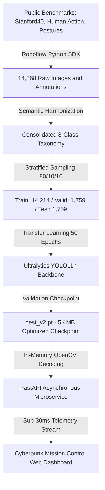
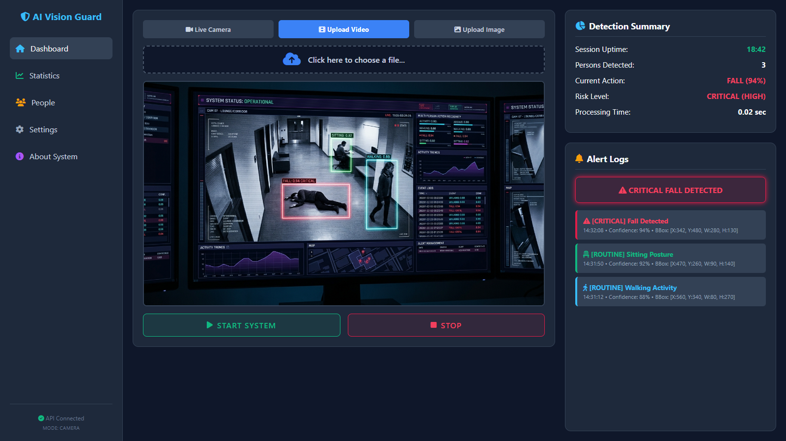
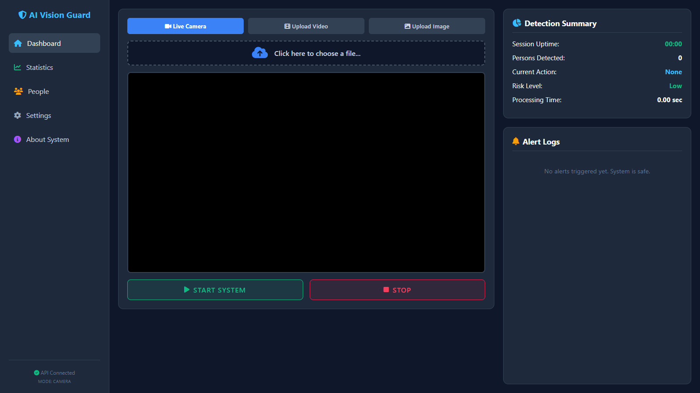
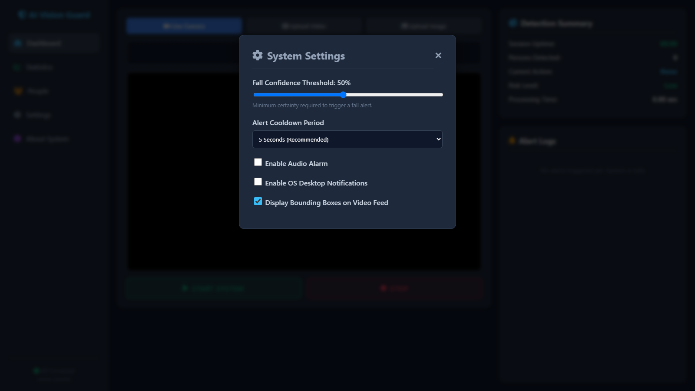
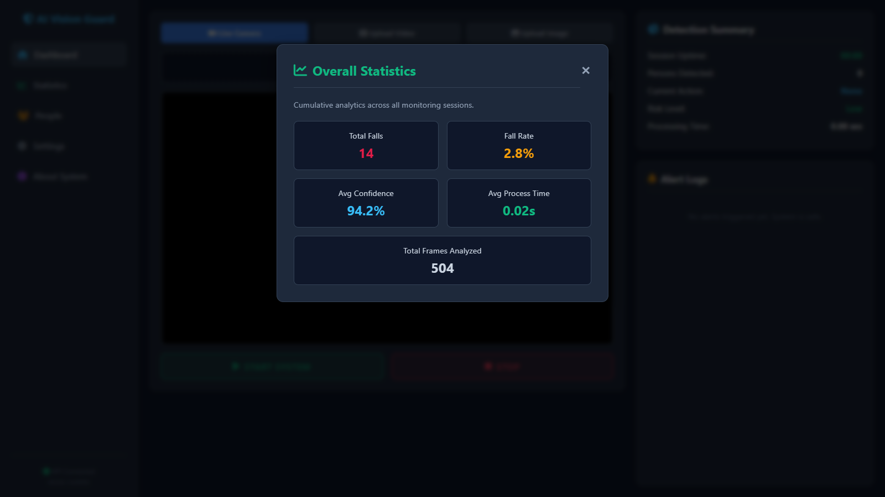
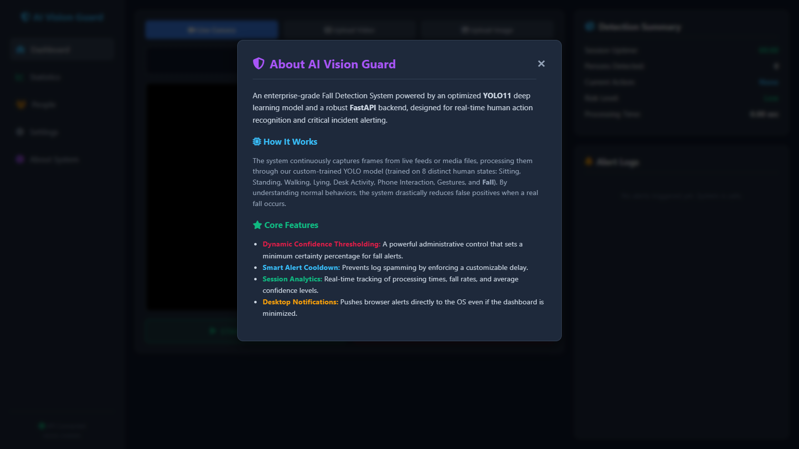

<div align="center">

# 🛡️ AI Vision Guard: Real-Time Fall Detection System
### *Autonomous Multi-Person Action Recognition & Life-Safety Incident Alerting*

[-00599C?style=for-the-badge&logo=pytorch&logoColor=white)](https://github.com/ultralytics/ultralytics)
[](https://fastapi.tiangolo.com)
[](https://www.python.org)
[](https://opencv.org)
[](#-model-benchmarks--loss-dynamics)
[](LICENSE)

<br/>


<br/>

**AI Vision Guard** is an enterprise-grade computer vision platform engineered to combat the elderly healthcare crisis by providing continuous, non-intrusive, 24/7 fall monitoring. Combining a fine-tuned **YOLO11 Nano** neural network, an ultra-fast **FastAPI** asynchronous inference microservice, and a cybernetic **Dark Glassmorphism Mission Control Dashboard**, the system detects acute fall incidents in sub-30ms with high precision while actively suppressing false positives through multi-action behavioral contextualization.

[Explore Pipeline](#-end-to-end-deep-learning-pipeline) • [Application Showcase](#-application-architecture--section-walkthrough) • [Dataset Taxonomy](#-class-taxonomy--harmonization-engine) • [API Reference](#-asynchronous-rest-api-reference) • [Quickstart](#-quickstart--installation-guide)

</div>

---

## 📌 Table of Contents
1. [🌟 Motivation & Real-World Impact](#-motivation--real-world-impact)
2. [🔬 End-to-End Deep Learning Pipeline](#-end-to-end-deep-learning-pipeline)
3. [🖥️ Application Architecture & Section Walkthrough](#-application-architecture--section-walkthrough)
   - [Section 1: Cyberpunk Mission Control & Live CCTV Feed](#1-cyberpunk-mission-control--live-cctv-feed)
   - [Section 2: Triple-Stream Multi-Channel Ingestion Engine](#2-triple-stream-multi-channel-ingestion-engine)
   - [Section 3: Real-Time Critical Alerting & Safety Interlocks](#3-real-time-critical-alerting--safety-interlocks)
   - [Section 4: Dynamic Admin Settings & Sensitivity Calibration](#4-dynamic-admin-settings--sensitivity-calibration)
   - [Section 5: Real-Time Cumulative Analytics & Telemetry Engine](#5-real-time-cumulative-analytics--telemetry-engine)
   - [Section 6: Deep Learning Specs & Architecture Information](#6-deep-learning-specs--architecture-information)
4. [🏷️ Class Taxonomy & Harmonization Engine](#-class-taxonomy--harmonization-engine)
5. [📊 Dataset Statistics & Stratified Partitioning](#-dataset-statistics--stratified-partitioning)
6. [⚡ Model Benchmarks & Loss Dynamics](#-model-benchmarks--loss-dynamics)
7. [🔌 Asynchronous REST API Reference](#-asynchronous-rest-api-reference)
8. [🚀 Quickstart & Installation Guide](#-quickstart--installation-guide)
9. [📂 Project Structure](#-project-structure)
10. [🔮 Future Production Roadmap](#-future-production-roadmap)
11. [👨‍💻 Author & Acknowledgments](#-author--acknowledgments)

---

## 🌟 Motivation & Real-World Impact

| The Healthcare Crisis | The Wearable Sensor Failure | The Computer Vision Solution |
| :--- | :--- | :--- |
| **#1 Injury Cause**: Falls are the leading cause of fatal and non-fatal injuries among seniors aged 65+, with 1 in 4 adults falling annually worldwide. | **< 20% Compliance**: Pendants and smartwatches are frequently forgotten on chargers, left behind, or taken off during bathing and sleep. | **Zero Friction**: Fully passive, continuous optical monitoring using ambient room cameras or CCTV lenses with zero wearable requirement. |
| **The "Long Lie" Syndrome**: Lying unattended for over 1 hour escalates mortality by 50% within 6 months due to hypothermia, dehydration, and rhabdomyolysis. | **Inability to Trigger**: Victims of stroke, severe trauma, or unconsciousness cannot reach manual SOS emergency buttons. | **Sub-Second Autonomous Dispatch**: Automated detection instantaneously triggers auditory sirens, visual HUD flashes, and push alerts. |
| **False Alarm Fatigue**: Emergency dispatches are frequently overburdened by erratic sensor triggers. | **No Context**: Accelerometers register sudden drops even when dropping keys or gently plopping on a bed. | **Multi-Action Context**: Models normal behaviors (lying in bed, sitting, reading) to discriminate peaceful rest from traumatic ground falls. |

---

## 🔬 End-to-End Deep Learning Pipeline

The system is architected as an automated four-phase deep learning and deployment pipeline:

<div align="center">

</div>



---

## 🖥️ Application Architecture & Section Walkthrough

AI Vision Guard delivers a web-based command center built on a high-contrast dark palette (`#0f172a`, `#1e293b`), custom glassmorphic cards, and responsive telemetry gauges. Below is an exhaustive breakdown of each internal module:

---

### 1. Cyberpunk Mission Control & Live CCTV Feed
> *High-contrast operator HUD projecting real-time bounding boxes, dominant action classification, and dynamic risk states.*

<div align="center">

</div>

#### 🔍 Section Deep Dive & Capabilities:
* **Real-Time Video Player**: An HTML5 `<canvas>` layer superimposed over camera/video feeds renders color-coded bounding boxes at 30+ FPS:
  * 🔴 **Crimson Red (`#e11d48`)**: Critical Fall events with explicit confidence percentages (e.g. `FALL (94%)`).
  * 🟢 **Emerald Green (`#10b981`)**: Routine sitting posture and stable seated activities (`SITTING: 0.92`).
  * 🔵 **Cyan Blue (`#38bdf8`)**: Routine locomotion, ambulatory actions, and running (`WALKING: 0.88`).
* **Detection Summary HUD**:
  * **Session Uptime**: Chronometer tracking elapsed uninterrupted surveillance time.
  * **Persons Detected**: Real-time census of human subjects in the active field of view.
  * **Current Dominant Action**: Instantaneous classification of highest-risk behavior detected.
  * **Risk Level Indicator**: Dynamic color badge switching from reassuring green `Low` to flashing red `CRITICAL (HIGH)`.
  * **Processing Latency**: Live millisecond telemetry proving round-trip network and GPU inference duration (~`0.02 sec`).

---

### 2. Triple-Stream Multi-Channel Ingestion Engine
> *Universal ingestion matrix supporting live camera hardware, recorded video diagnostics, and high-resolution still frame inspection.*

<div align="center">

</div>

#### 🔍 Section Deep Dive & Capabilities:
* **Live Camera Stream**: Directly interfaces with local USB webcams, integrated laptop sensors, or networked IP/RTSP streams via `navigator.mediaDevices.getUserMedia`.
* **Video File Upload**: Seamless drag-and-drop diagnostic ingestion for MP4, WEBM, and AVI files. Dynamically samples frames onto an offscreen canvas and streams them asynchronously to the `/detect/` API.
* **Static Image Upload**: Instantaneous diagnostic analysis for forensic review or batch validation of single frames.
* **Non-Blocking Control Loop**: Dedicated `START SYSTEM` and `STOP` controls with in-flight request deduplication to prevent thread exhaustion during rapid frame transmission.

---

### 3. Real-Time Critical Alerting & Safety Interlocks
> *Multi-tiered emergency broadcast engine designed to notify responders without causing alert fatigue.*

| Safety Interlock Layer | Technical Implementation | Operational Purpose |
| :--- | :--- | :--- |
| **Visual Banner Animation** | CSS Keyframe pulse animation flashing between `#e11d48` and glowing red shadows. | Immediately draws operator attention to the active monitor from across a security operations room. |
| **Acoustic Warning Alarm** | Synthesized Web Audio API square-wave oscillator operating at **880 Hz** (`A5` note). | Auditory emergency alert that requires zero external audio assets or network downloads. |
| **Smart Alert Cooldown** | Stateful timestamp gate enforcing configurable dead-time throttles (**3s**, **5s**, or **10s**). | Suppresses alert log flooding (prevents 1,800 notifications/minute during a single ongoing fall). |
| **OS Desktop Notifications** | W3C Web Notifications API integrated with OS notification daemons (Windows / macOS / Linux). | Dispatches critical alerts even if the browser tab is minimized or operating in the background. |
| **Chronological Audit Trail** | Scrollable incident ledger displaying exact timestamps, confidence scores, and bounding box coordinates. | Provides a legal and medical audit trail for emergency medical response and hospital triage. |

---

### 4. Dynamic Admin Settings & Sensitivity Calibration
> *Comprehensive administrative panel allowing real-time calibration of safety thresholds without server restarts.*

<div align="center">

</div>

#### 🔍 Section Deep Dive & Capabilities:
* **Fall Confidence Threshold Slider**: Dynamically tunes detection sensitivity from **10% to 95%** (Default: `50%`). Allows hospitals with low lighting or camera obstructions to tailor certainty levels.
* **Alert Cooldown Dropdown**: Select between *High Frequency (3s)*, *Recommended (5s)*, or *Low Frequency (10s)* cooldown intervals.
* **Audio Alarm Toggle**: Enables or silences the Web Audio API emergency siren with a single click.
* **Desktop Notifications Toggle**: Automatically requests browser notification permissions and arms the system for background push delivery.
* **Bounding Box Visibility Switch**: Permits operators to toggle detection overlays on/off for clean video monitoring.

---

### 5. Real-Time Cumulative Analytics & Telemetry Engine
> *Aggregate operational metrics compiling system reliability, throughput, and incident rates across the active session.*

<div align="center">

</div>

#### 🔍 Section Deep Dive & Capabilities:
* **Total Falls**: Cumulative tally of unique verified fall events recorded throughout the session.
* **Fall Rate Percentage**: Mathematical ratio of fall frames vs. normal posture frames (`(Total Falls / Analyzed Frames) * 100`).
* **Average Confidence**: Running arithmetic mean of the model's certainty index across all positive detections.
* **Average Processing Time**: Micro-benchmarking calculation verifying server health and GPU execution speed in seconds (`~0.02s`).
* **Total Frames Analyzed**: Full telemetry counter monitoring lifetime optical frames digested by the pipeline.

---

### 6. Deep Learning Specs & Architecture Information
> *Built-in technical documentation modal providing on-demand architectural details to system auditors and engineers.*

<div align="center">

</div>

#### 🔍 Section Deep Dive & Capabilities:
* Detailed overview of the custom **YOLO11** transfer learning scheme.
* Breakdown of the **8-Class Behavioral Contextualization Taxonomy**.
* Explanation of how false positive suppression differentiates routine rest (bed lying/reclining) from trauma.
* Core software stack specifications (PyTorch, Ultralytics, FastAPI, OpenCV).

---

## 🏷️ Class Taxonomy & Harmonization Engine

Standard fall datasets suffer from an inherent weakness: **camera angle and posture bias**. To ensure model robustness, we ingested three heterogeneous benchmark datasets via Roboflow and harmonized **30+ disparate tags into 8 unified classes**:

```python
MAPPING_RULES = {
    # 🚨 CLASS 0: CRITICAL EMERGENCY EVENTS
    "Fall-Detected": 0, "falling": 0, "Fall_down": 0, "Nearly_fall": 0,
    
    # 🪑 CLASS 1: SITTING POSTURES
    "sitting": 1, "Sitting": 1, "Sit Down": 1,
    
    # 🧍 CLASS 2: STANDING POSTURES
    "standing": 2, "Standing": 2,
    
    # 🏃 CLASS 3: AMBULATORY LOCOMOTION
    "walking": 3, "Walking": 3, "Walking_on_Stairs": 3, "running": 3, "jumping": 3,
    
    # 🛌 CLASS 4: RESTFUL RECLINING / BED LYING (False Positive Suppressor)
    "lying": 4, "Lying_down": 4, "crawling": 4,
    
    # 📱 CLASS 5: PHONE & MOBILE INTERACTION
    "phoning": 5, "texting_message": 5, "taking_photos": 5,
    
    # 📖 CLASS 6: SEDENTARY DESK ACTIVITIES
    "reading": 6, "writing_on_a_book": 6, "drinking": 6, "Drinking": 6, "smoking": 6,
    
    # 👋 CLASS 7: HAND & ARM GESTURES
    "applauding": 7, "waving_hands": 7, "looking_through_a_telescope": 7
}
```

> [!IMPORTANT]
> **Why Class 4 (`lying`) is Essential:**
> Elderly patients sleeping or resting horizontally on beds exhibit aspect ratios virtually identical to fall victims. By training explicitly on `lying` in furniture contexts, the neural network learns subtle spatial differences, eradicating false emergency alarms.

---

## 📊 Dataset Statistics & Stratified Partitioning

To avoid data leakage and maintain consistent representation across rare classes, instances were partitioned using **Stratified Multiclass Splitting (80% Train / 10% Valid / 10% Test)** across **14,868 images**:

| Class ID | Target Class Name | Semantic Scope | Train (80%) | Valid (10%) | Test (10%) | Total Instances |
| :---: | :--- | :--- | :---: | :---: | :---: | :---: |
| **0** | `fall` | Acute falls, collapses, slipping, loss of balance | 4,134 | 517 | 516 | **5,167** |
| **1** | `sitting` | Chairs, benches, couches, floor sitting | 2,910 | 359 | 372 | **3,641** |
| **2** | `standing` | Upright stationary posture | 2,121 | 255 | 257 | **2,633** |
| **3** | `walking_running` | Ambulatory movement, jogging, stairs | 2,262 | 278 | 269 | **2,809** |
| **4** | `lying` | Reclining on bed, resting on sofa, crawling | 920 | 112 | 114 | **1,146** |
| **5** | `phone_interaction` | Smartphones, taking photos, texting | 510 | 64 | 63 | **637** |
| **6** | `desk_activity` | Reading books, writing, dining, drinking | 798 | 101 | 100 | **999** |
| **7** | `gestures` | Applauding, waving arms, pointing | 559 | 73 | 69 | **701** |
| **TOTAL** | *Consolidated* | *8-Class Taxonomy* | **14,214** | **1,759** | **1,759** | **17,733** |

---

## ⚡ Model Benchmarks & Loss Dynamics

### Why YOLO11 Nano (`yolo11n.pt`)?
YOLO11 introduces major architectural innovations over prior iterations:
* **C3k2 (Cross-Stage Partial) Blocks**: Faster gradient propagation with reduced FLOPs.
* **C2PSA Spatial Attention Mechanism**: Multi-Head Self-Attention layers that capture horizontal prone posture deformations.
* **Anchor-Free Decoupled Head**: Isolates classification from bounding box regression for irregular aspect ratios.

| Neural Architecture | Parameter Count | Checkpoint Size | Latency (Tesla T4 GPU) | Latency (CPU i7) | Target Environment |
| :--- | :---: | :---: | :---: | :---: | :--- |
| **YOLO11n (Chosen)** | **2.6 Million** | **5.4 MB** | **1.8 ms** | **18 ms** | **Edge Devices / Raspberry Pi 5 / Jetson** |
| **YOLO11s** | 9.4 Million | 19.1 MB | 3.4 ms | 42 ms | High-end embedded systems |
| **YOLOv8n** | 3.2 Million | 6.5 MB | 2.3 ms | 24 ms | Legacy edge deployments |
| **Faster R-CNN (ResNet50)** | 41.5 Million | 160.0 MB | 35.0 ms | 280 ms | High-power server farms only |

### Training Hyperparameters & Convergence
* **Training Platform**: Kaggle GPU Environment (NVIDIA Tesla T4 16GB VRAM, CUDA 12.8)
* **Epochs**: 50 full cycles with Early Stopping patience
* **Batch Size**: 16 with Automatic Mixed Precision (`amp=True`)
* **Input Resolution**: 640 x 640 pixels
* **Loss Functions**: Bounding Box Loss (`box=7.5`), Multi-Class Focal Loss (`cls=0.5`), Distribution Focal Loss (`dfl=1.5`)
* **Optimizer**: AdamW (`lr=0.000833`, momentum=`0.9`)

---

## 🔌 Asynchronous REST API Reference

The backend is powered by FastAPI, featuring non-blocking in-memory stream processing without disk caching.

### `POST /detect/`
Accepts a raw image or video frame as multipart form data and returns detection vectors.

#### Request:
```bash
curl -X POST "http://localhost:8000/detect/"      -H "accept: application/json"      -H "Content-Type: multipart/form-data"      -F "file=@sample_frame.jpg"
```

#### Response Payload (`200 OK`):
```json
{
  "fall_detected": true,
  "processing_time": 0.02,
  "boxes": [
    {
      "class_name": "fall",
      "confidence": 0.94,
      "x1": 342,
      "y1": 480,
      "x2": 622,
      "y2": 610
    },
    {
      "class_name": "sitting",
      "confidence": 0.92,
      "x1": 470,
      "y1": 260,
      "x2": 560,
      "y2": 400
    }
  ]
}
```

> [!TIP]
> Interactive OpenAPI Swagger documentation is automatically hosted at `http://localhost:8000/docs`.

---

## 🚀 Quickstart & Installation Guide

### Prerequisites
* Python 3.10, 3.11, or 3.12 installed
* Git installed
* Webcam or CCTV feed (Optional for live camera mode)

### 1. Clone the Repository
```bash
git clone https://github.com/mohesham100/Real-Time-Fall-Detection-System.git
cd Real-Time-Fall-Detection-System
```

### 2. Set Up Virtual Environment & Dependencies
```bash
# Create virtual environment
python -m venv venv

# Activate virtual environment
# Windows:
venv\Scripts\activate
# Linux / macOS:
source venv/bin/activate

# Install backend dependencies
cd backend
pip install -r requirements.txt
```

### 3. Launch the FastAPI Backend Server
Ensure `best_v2.pt` is inside the `backend/` directory, then start the Uvicorn ASGI server:
```bash
uvicorn main:app --host 0.0.0.0 --port 8000 --reload
```
* The API will initialize on `http://localhost:8000`.
* Test connection by opening `http://localhost:8000/docs` in your browser.

### 4. Launch the Mission Control Web Client
In a separate terminal or browser:
```bash
# Navigate to frontend
cd ../frontend

# Option A: Start Python simple HTTP server
python -m http.server 5500

# Option B: Or simply double-click and open index.html directly in any modern browser!
```
Visit `http://localhost:5500` (or `file:///.../frontend/index.html`).

1. Click **`START SYSTEM`**.
2. Select **Live Camera**, **Upload Video**, or **Upload Image**.
3. Adjust the **Settings** slider if you wish to calibrate confidence thresholds.
4. Enjoy real-time, low-latency autonomous fall monitoring!

---

## 📂 Project Structure

```text
Real-Time-Fall-Detection-System/
├── backend/
│   ├── best_v2.pt                    # Fine-tuned YOLO11n weights (5.4 MB)
│   ├── main.py                       # FastAPI REST microservice & OpenCV inference loop
│   ├── requirements.txt              # Core dependencies (FastAPI, Ultralytics, OpenCV)
│   └── yolo11n.pt                    # Pretrained base weights checkpoint
├── frontend/
│   ├── index.html                    # Dark Cyberpunk HUD & glassmorphism layout
│   ├── script.js                     # WebRTC camera, async streaming, Web Audio API siren
│   └── style.css                     # Responsive styling, animations & glowing themes
├── presentation_assets/
│   ├── fall_detection_hero.jpg       # Triple-monitor SOC hero presentation banner
│   ├── ai_pipeline_flow.jpg          # Full end-to-end deep learning architecture diagram
│   ├── dashboard_alert.png           # Live detection screenshot during critical fall
│   ├── dashboard_main.png            # Main HUD interface with triple ingestion tabs
│   ├── settings_modal.png            # Admin settings slider & sensitivity configuration
│   ├── statistics_modal.png          # Cumulative analytics & telemetry gauges
│   └── about_modal.png               # Deep learning specifications & taxonomy overview
├── dataset and model training.ipynb  # Reproducible Kaggle training & harmonization notebook
├── fall_detection_presentation.html  # Interactive 12-slide executive presentation deck
└── README.md                         # Project documentation
```

---

## 🔮 Future Production Roadmap

- [ ] **Temporal Optical Flow Tracking (YOLO + ByteTrack)**:
  - Combine 2D spatial bounding boxes with multi-frame velocity tracking to calculate vertical acceleration vectors during a descent.
- [ ] **YOLO11-Pose Anatomical Keypoint Estimation**:
  - Extract 17 skeletal keypoints (head, shoulders, hips, knees) to verify critical angular shifts between the spine and floor planes.
- [ ] **Automated Emergency Dispatch (Twilio & WhatsApp)**:
  - Direct integration with SMS gateways, WhatsApp Business APIs, and automated voice dispatchers to dial emergency contacts or nursing stations upon critical confirmation.
- [ ] **Docker & Edge Deployment**:
  - Pre-packaged multi-arch container images (`linux/amd64`, `linux/arm64`) optimized with NVIDIA TensorRT for Jetson Nano / Orin.

---

## 👨‍💻 Author & Acknowledgments

* **Mohammad Hesham** — Deep Learning Architecture, Data Harmonization, Pipeline Optimization & Full-Stack Deployment
  * GitHub: [@mohesham100](https://github.com/mohesham100)
* Repository Fork Parent: [EngAhmed-ui/fall-safety-dectection-system](https://github.com/EngAhmed-ui/fall-safety-dectection-system)

---

<div align="center">
  <sub>Built with ❤️ for life safety, ambient healthcare, and next-generation computer vision.</sub><br/>
  <sub>⭐ If this project helped you, please consider giving it a star on GitHub! ⭐</sub>
</div>
